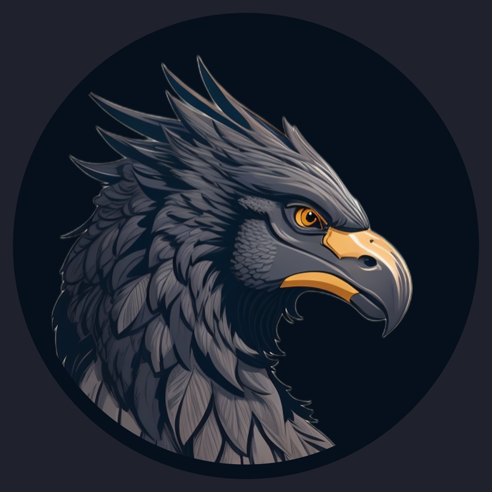

# BUKKBEEK Portfolio Website

  
  <h3><a href="https://bukkbeek.github.io">bukkbeek.github.io</a></h3>

## 👋 Welcome to My Portfolio

This repository contains the source code for my personal portfolio website, showcasing my work as a Game Asset Developer specializing in stylized game-ready assets. The site is built using React, TypeScript, and Tailwind CSS, and is hosted on GitHub Pages.

## 🎮 About Me

I'm BukkBeek (Jude Janitha Niroshan, Dunukumara Udumullage), a freelance 3D Generalist and VFX Artist with a background in zoology. I specialize in creating stylized, low-poly, and cartoonish 3D models and game assets with a unique artistic style. My work ranges from environmental assets to character models and visual effects, all optimized for game development.

## 🚀 Portfolio Highlights

### Featured Projects
- **Ceylon Blocks** - My flagship work featuring stylized building blocks
- **Nomad's Barge** - Detailed water vessel with unique design elements
- **Motorbike Adventure** - Low-poly vehicle model with character integration
- **Castle Island** - Fantasy environment with architectural focus
- **Tanker Truck** - Industrial vehicle model with game-ready optimization

### Major Development Tools
- **Godot Pixel Renderer** - Open-source 3D to pixel art renderer for Godot 4+ (Featured by Games From Scratch)
- **EffectBlocks VFX Toolkit** - Best-selling low-poly stylized effects pack for Godot

### VFX & Effects Expertise
- **EffectBlocks VFX Toolkit** - Comprehensive low-poly VFX toolkit for Godot (Community favorite)
- **Stylized Particle Effects** - Custom cartoonish particle systems for indie games
- **Godot Shader Effects** - Advanced visual effects and shaders
- **Low-poly & Cartoonish VFX** - Specialized in stylized visual effects

### Games
- **EION** (in development) - Original game concept with unique mechanics
- **Jumble Merge** - Puzzle game with colorful aesthetics
- **Titan Adventure** - Action platformer with stylized characters
- **Truck Runner** - Vehicle-based endless runner

## 💻 Technical Implementation

This portfolio is built with:
- **React** + **TypeScript** - For component-based UI development
- **Tailwind CSS** - For responsive and modern styling
- **Vite** - For fast development and optimized builds
- **GitHub Pages** - For hosting the static site

## 🔗 Connect With Me

- **Sketchfab**: [bukkbeek](https://sketchfab.com/bukkbeek)
- **Itch.io**: [bukkbeek](https://bukkbeek.itch.io/)
- **GitHub**: [bukkbeek](https://github.com/bukkbeek)
- **YouTube**: [@bukkbeek4986](https://www.youtube.com/@bukkbeek4986)
- **Facebook**: [bukkbeek](https://www.facebook.com/bukkbeek/)
- **Instagram**: [bukkbeek](https://www.instagram.com/bukkbeek/)
- **Email**: bukkbeek3d@gmail.com

## 📝 License

This project is available as a portfolio showcase. The code structure can be referenced, but the personal branding, images, and content are proprietary.

## 🔑 Keywords

3D Generalist, VFX Artist, GameAssets, 3D, 2D, lowpoly, low poly, cartoonish, stylized, game development, Sri Lanka, assets, portfolio, React, TypeScript, Tailwind CSS, Godot VFX, EffectBlocks VFX toolkit, Godot Pixel Renderer, Godot 4, particle effects, stylized effects, cartoonish VFX, Ceylon heritage, tropical assets, indie game development, mobile game VFX, stylized game art, cartoonish 3D art

---

## 💻 Source Files

This repository contains the finalized portfolio website. If you're interested in using this as a template or exploring the source files, feel free to reach out to me!
